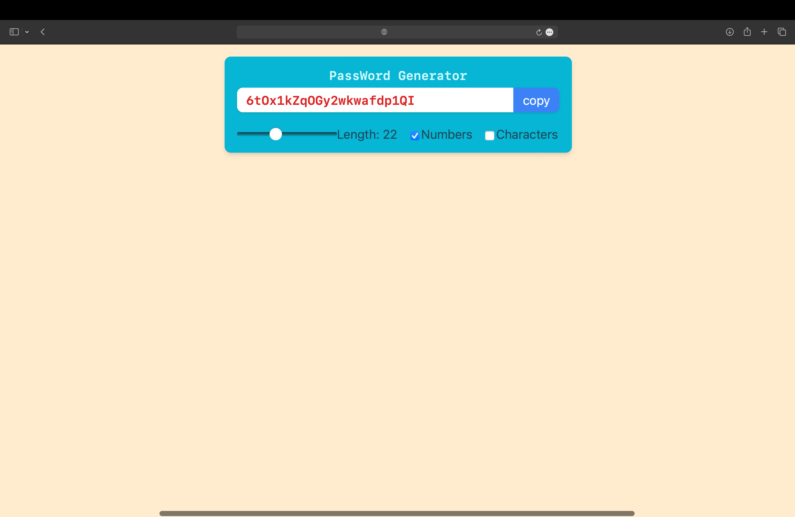

# Password Generator

This is a simple Password Generator application built with React. The app allows you to generate random passwords with customizable length and options to include numbers and special characters.

## Features

- Generate random passwords of customizable length.
- Option to include numbers in the password.
- Option to include special characters in the password.
- Copy generated password to the clipboard with a single click.

## Technologies Used

- React
- JavaScript
- Tailwind CSS

## Getting Started

These instructions will get you a copy of the project up and running on your local machine for development and testing purposes.

### Prerequisites

You need to have Node.js and npm installed on your machine.

- [Node.js](https://nodejs.org/)
- [npm](https://www.npmjs.com/)

### Installation

1. Clone the repository:
    ```
    git clone https://github.com/akshar625/PassWord_Generator.git
    ```

2. Navigate to the project directory:
    ```
    cd password-generator
    ```

3. Install the dependencies:
    ```
    npm install
    ```

### Running the Application

To start the development server, run:
    ```
    npm start
    ```

This will start the application on [http://localhost:3000](http://localhost:3000).

### Building the Application

To create a production build, run:
    ```
    npm run build
    ```

This will create a `build` directory with the production build of the app.

## Usage

1. Open the application in your browser.
2. Adjust the password length using the slider.
3. Check the boxes to include numbers and/or special characters.
4. The generated password will be displayed in the input field.
5. Click the "Copy" button to copy the password to your clipboard.

## Screenshot



## Contributing

Contributions are welcome! Please feel free to submit a Pull Request.


## Acknowledgements

- [React](https://reactjs.org/)
- [Tailwind CSS](https://tailwindcss.com/)
- [Node.js](https://nodejs.org/)
